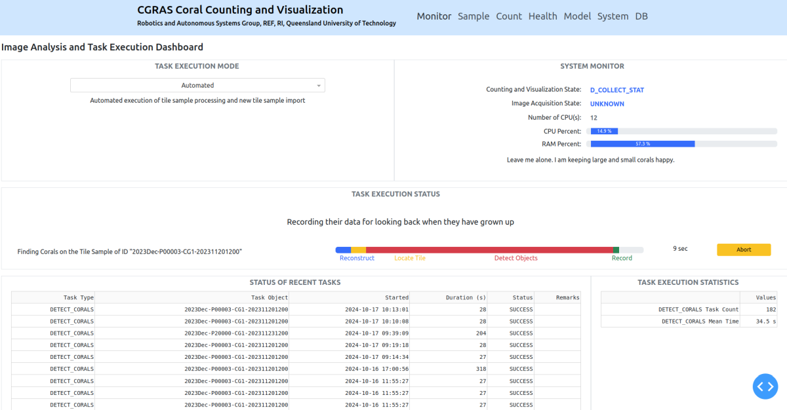
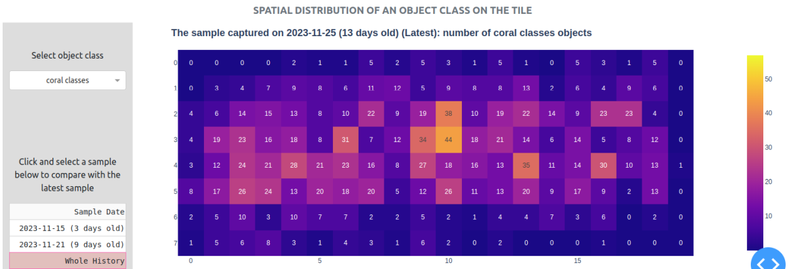

# CGRAS 2025: Coral Counting and Visualization System

The **Coral Counting and Visualization System (CCVS)** is part of the CGRAS 2025 platform. CCVS is designed for monitoring the well being of the growing coral babies on aquacultural tiles by analysing tile images and counting the number of corals and other objects. 

CCVS operates as an autonomous system that streamlines fetching of newly acquired tile images (from the other systems of CGRAS 2025), applying of deep learning object detection models on the images, analyzing and recording of data, and presenting of useful findings.  CCVS provides a web-based user interface for interactive visualization of trends of coral growth on tiles. It also offers control for the users to override the autonomous operations and to enhance the analysis with import of new models.  





## Running the Node

After building the workspace, execute the following
```
rosrun cgras_detector run.py
```

## Installation (Docker)

The [Dockerfile](docker/Dockerfile) for building the environment is in the `docker` directory of this repository. The file [docker-compose.yaml](docker/docker-compose.yaml) enables the management of containers as services. It has been tested with Docker 25.0.3 and Ubuntu 20.04. First change directory to where the file is located, and then build the image using the command below.
```
cd docker
docker compose build cgras_image
```
The image building may take some time. When the build is completed, execute the following to check if the image `cgras_image` is there.
```
docker image ls
```
Execute below to allow applications in the container to display a GUI on the host.
```
xhost +
```
Create a workspace for CGRAS in your local computer.
```
cd ~
mkdir -p ~/cgras_ws/src
```
Clone the `cgras_detector` and `cgras_datatools` repositories to the workspace
```
cd ~/cgras_ws/src
git clone git@github.com:REF-RAS/cgras_detector.git
git clone git@github.com:REF-RAS/cgras_datatools.git
```
Create a folder for system data at `cgras_data`.
```
mkdir -p ~/cgras_data
```
Start a container based on the image. Note that the two packages above and the data folder will become read/write volumes mapped to the container. 
```
docker compose up cgras_image
```
To obtain an interactive shell of the container
```
docker compose exec cgras_image bash
```
In the interactive shell, build the system and launch the node.
```
cd ~/cgras_ws
catkin_make
source devel/setup.bash
roslaunch cgras_detector default.launch
```


## Developer

Dr Andrew Lui, Senior Research Engineer <br />
Robotics and Autonomous Systems, Research Engineering Facility <br />
Research Infrastructure <br />
Queensland University of Technology <br />

Latest update: Apr 2025