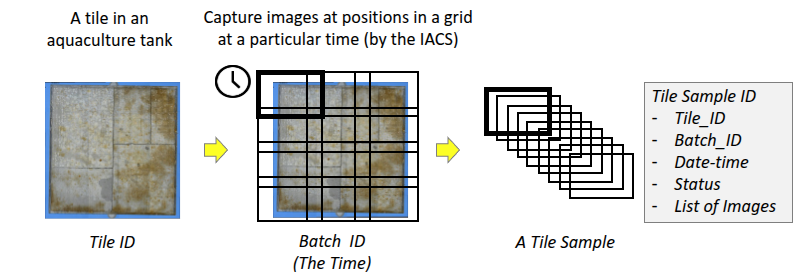
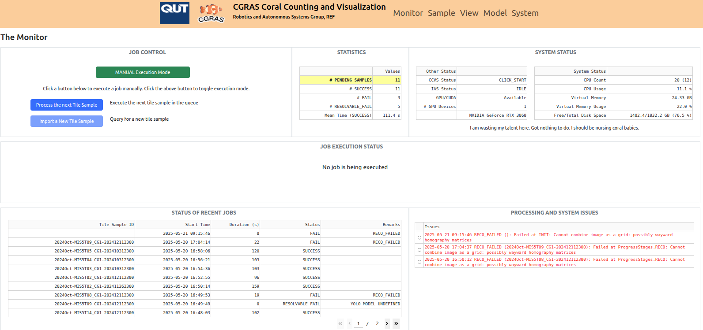
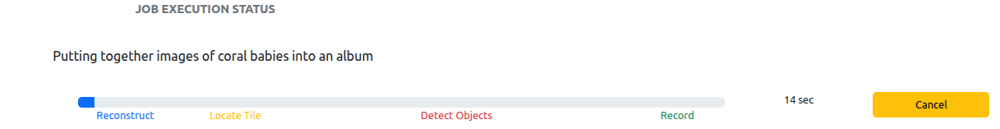
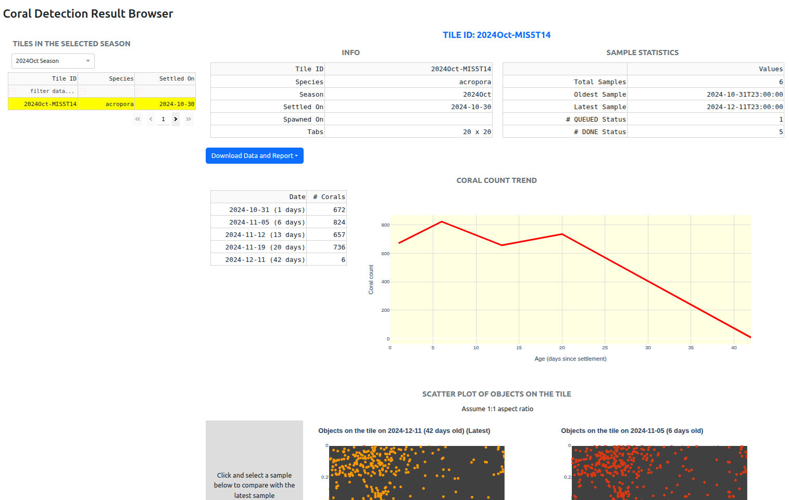
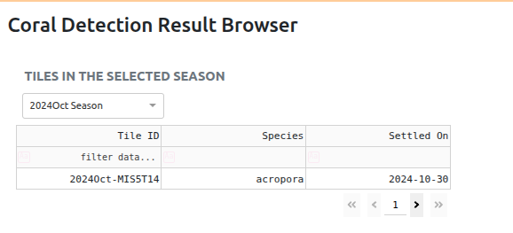
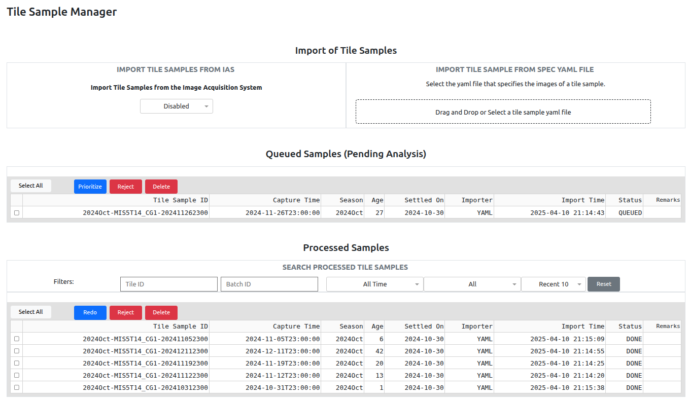
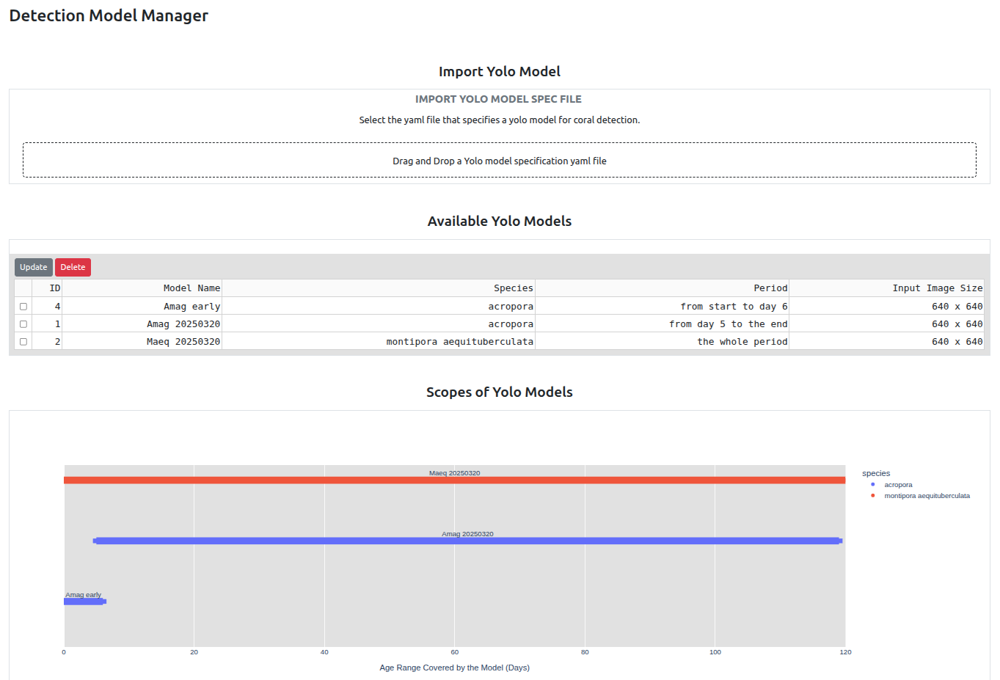

# CGRAS 2025: Coral Counting and Visualization System

The **Coral Counting and Visualization System (CCVS)** is one of the two systems of the CGRAS 2025 platform. It is designed to monitor the coral recruitment process in tanks with acquaculture tiles. It achieves the objective based on visual analytics on images captured of the tiles, which involves the application of deep-learning based object detection models, the post-processing of identified objects, and the presentation of the findings. CCVS provides a web interface for users to monitor and control the visual analytics process, to manage the image samples, and to visualize the trend and distribution of corals of a tile. 

At the upstream of the CGRAS 2025 finds the **Image Acquisition Coorindation System (IACS)**, which is designed to autonomously capture images of acquaculture tiles in a operation zone called the **CGRAS Arena**. 

## Basic Operation

The CCVS can operate in tendem with the IACS, from which the input images of tile samples are retrieved through the ROS middleware. It can also operate in a stand-alone manner, in which case the input images can be imported through the user interface or a RESTful API.

The input images are organized as tile samples. A tile sample is a set of images captured of a tile. Depending on the image capturing device, multiple images may be required to capture all areas of a tile at a required resolution. The images are expected to arrange in a grid-like manner. A tile sample is associated with a particular tile, identified by the __tile_id__, and the capture time, identified by the __batch_id__.

The operation of the CCVS is centred around management and processing of tile samples.  The following illustrates the generation and the associated data of a tile sample.



### Job Monitor and Control with the Application Monitor

The following shows the first screen - the Application Monitor, which is structured into four areas.



The top-left corner is the __job control__ panel. CCVS has defined two job types: (1) coral detection of a tile sample and (2) retrieval of a tile sample from the IACS. In the __Automated Execution Mode__, the system autonomously polls the tile sample manager for samples pending for coral detection. It also autonomously polls the IACS for new tile samples. In the __Manual Execution Mode__, the buttons in the panel is enabled for users to execute the job one at a time. 

The remainder of the top panel includes tables showing the statistics of tile sample processing, the status of the two CGRAS systems and the computing resources of the host computer.

The job of coral detection of a tile sample involves several computation intensive steps:
- Logically stitch the images of a tile sample together into the original visual appearance of the tile.
- Reduce visual distortion and locate the tile region from other structural elements such as tile holders and spacers.
- Split the images up into smaller parts for coral detection by one or more object detector models.
- Refine the detected coral objects, which include duplication removal and classification resolution, and store away the findings.

The __job execution__ panel in the middle displays the progress when a coral detection job is being executed. It also displays the ID of the tile sample being analyzed, the time taken so far, and a button for cancelling the job. After a job is cancelled, the execution mode is set to manual.



The panels at the bottom are the recent executed job list on the left and the list of system issues and errors on the right.The recent job list shows whether the final status of the execution was successful or failed. If the failure requires the attention of the users, the system issue and error list will provide the details. Poor quality images, corrupted tile samples, and detection model misconfiguration are common examples of system issues. The system issue in the list can be clicked and dismissed.

### Interactive Visualization with the Result Browser

The following shows another main screen - the Result Browser, thought which the measurements of a particular acquaculture tile can be queried and visualized. 



Known tiles of the selected season are shown in the search table on the left side of the page.  Another spawning season may be selected using the dropdown menu at the top (as shown in the figure below). The table offers filters on each column for getting to the target tile quicker. Use the pagination controls at the bottom of the table to go through pages of tiles.  



Click on a row to inspect a tile's measurement results on the right side. The right pane is divided vertically into four sections (from top to bottom): 
- Key information of the tile and statistics of its samples.
- The number of corals at various sampling time presented as a trend chart and a table.
- The locations of detected corals and other key object classes of the latest sample presented as a scattered map. 
- The locations of detected corals or other key object classes of the latest sample presented as a heatmap. 

The last two sections offers users to interactively select samples to inspect and compare. 
- For the scattered map, click on the sampling time in the table on the left pane for comparison.  
- For the heatmap, click on the sampling time in the table on the left for comparison, or **Whole History** to display the heatmaps of all samples. Use the **Reverse** button to reverse the ordering of the heatmap. The top dropdown menu allows selection of the coral object class to view. The slider gives users the ability to hide labels of low count cells to reduce cluttering.  

### Data Handling with the Tile Sample Manager

The following shows the Tile Sample Manager, which supports manual handling of tile samples and monitoring the processing status.



There are two panes at the top, which are the toggle switch for enabling/disabling automatic retrieval of tile samples from the Image Acquisition Coordinator System, and the drop area for manual import of tile sample specification yaml files. 
- Automatic retrieval of tile samples will happen only if the toggle switch is enabled and the Automated Execution Mode is eanbled.
- Tile samples can be imported manually through a specification yaml file, which contains the locations of the image files and other critical information.

The remainder of the page contains a table displaying the tile samples pending for processing and another table displaying the status of the processed tile samples. Use the buttons associated with the table to change the status of tile samples. Select one or more tile sample in the table and press the desired button.

The statuses of tile samples include:
- `QUEUED`: The tile sample pending processing is waiting in a queue.
- `DONE`: The tile sample has been processed successfully.
- `REJECTED`: The tile sample has been rejected by the system due to an inherent problem found in the processing. It may also be rejected according to external knowledge by the user.
- `FLAGGED`: The tile sample is tagged by the system due to a problem found in the processing but user inspection should resolve the problem. 

The functions of the buttons are explained below.
- `Prioritize`: Move the selected tile samples to the front of the queue.
- `Reject`: Reject the selected tile samples.
- `Delete`: Delete the tile sample permanantly from the CCVS (note: the IACS is not affected)
- `Redo`: Move the selected tile to the queue for re-processing, existing results can be selectively kept.

### The Detection Model Manager

The Detection Model Manager provides an interface for the import of trained YOLO coral detection model into the system and for specifying the conditions in which the model is applied. The conditions include the coral species and the age of the tile sample. 



The top pane is the drop area for the import of a detection model specification yaml file.  In the middle the table displays the imported detection models and there are buttons for updating and deleting a model. The bottom pane shows a visualization of the coverage of each model in the species and in the coral age of the target tile samples.

## System Installation

The CCVS is written in Python and it is designed to run in a ROS1 (noetic) environment. It will run significantly more efficient with the support of CUDA/GPU but it can also run on a pure CPU host.

### 


It is designed for monitoring the well being of the growing coral babies on aquacultural tiles by analysing tile images and counting the number of corals and other objects. 

CCVS operates as an autonomous system that streamlines fetching of newly acquired tile images (from the other systems of CGRAS 2025), applying of deep learning object detection models on the images, analyzing and recording of data, and presenting of useful findings.  CCVS provides a web-based user interface for interactive visualization of trends of coral growth on tiles. It also offers control for the users to override the autonomous operations and to enhance the analysis with import of new models.  


## Running the Node

After building the workspace, execute the following
```
rosrun cgras_detector run.py
```

## Installation (Docker)

The [Dockerfile](docker/Dockerfile) for building the environment is in the `docker` directory of this repository. The file [docker-compose.yaml](docker/docker-compose.yaml) enables the management of containers as services. It has been tested with Docker 25.0.3 and Ubuntu 20.04. First change directory to where the file is located, and then build the image using the command below.
```
cd docker
docker compose build cgras_image
```
The image building may take some time. When the build is completed, execute the following to check if the image `cgras_image` is there.
```
docker image ls
```
Execute below to allow applications in the container to display a GUI on the host.
```
xhost +
```
Create a workspace for CGRAS in your local computer.
```
cd ~
mkdir -p ~/cgras_ws/src
```
Clone the `cgras_detector` and `cgras_datatools` repositories to the workspace
```
cd ~/cgras_ws/src
git clone git@github.com:REF-RAS/cgras_detector.git
git clone git@github.com:REF-RAS/cgras_datatools.git
```
Create a folder for system data at `cgras_data`.
```
mkdir -p ~/cgras_data
```
Start a container based on the image. Note that the two packages above and the data folder will become read/write volumes mapped to the container. 
```
docker compose up cgras_image
```
To obtain an interactive shell of the container
```
docker compose exec cgras_image bash
```
In the interactive shell, build the system and launch the node.
```
cd ~/cgras_ws
catkin_make
source devel/setup.bash
roslaunch cgras_detector default.launch
```


## Developer

Dr Andrew Lui, Senior Research Engineer <br />
Robotics and Autonomous Systems, Research Engineering Facility <br />
Research Infrastructure <br />
Queensland University of Technology <br />

Latest update: Apr 2025