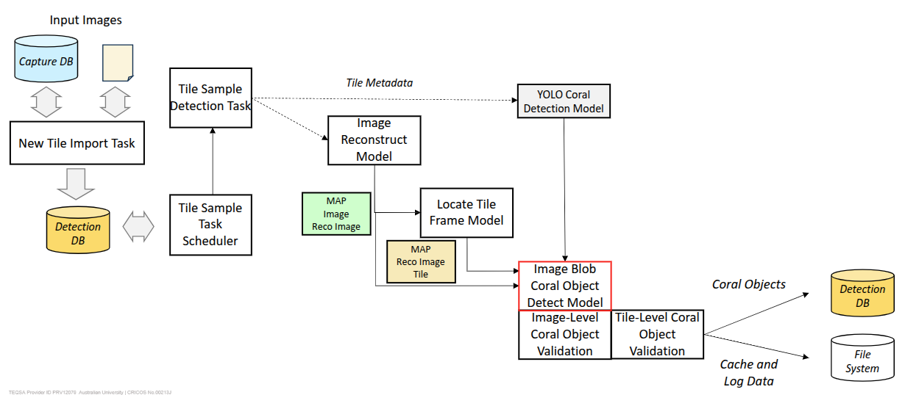

# CGRAS 2025: Semantics of Coral Classes and the Hierchical Class Structure

Monitoring the number of corals in the early post-settlement period of microscopic coral recruit phase is desirable in coral aquaculture operations and research. The data is imperative for the evaluation of instrument design and operational parameters, and for extending the knowledge of coral growing in controlled environments. The task is now often carried out by coral experts, who have the knowledge to identify coral recruits from images of coral aquaculture tiles captured by a camera. 

The major objective of CGRAS is to automate the task. The task has become a two-stage procedure of capturing images with a robotic system and analysing the capture images using novel coral object detection models.  Building such coral object detection models is challenging because of several reasons.  First, the field of coral aquculture is being developed. 

Coral recruitment is divided into several early life-history phases. Monitoring the number of corals in the post-settlement and metamorphosis of microscopic coral recruit phase is the major objective of CGRAS. The application of computer vision and autonomous image capturing devices for the task can save human effort, support large-scale restoration projects, and generate abundance of data for research and operational needs. However, a significant knowledge gap concerning the design and development of such autonomous solutions exists. In particular, effective use of the deep-learning object detection algorithm for early post-settlement corals is largely a untouched research topic.   

The visual appearance of corals of different species can differ drastically. There are over 600 species in the Great Barrier Reef alone. Even for corals of the same species, the shape, color, and structure of corals can change significantly within weeks. The following figure illustrates the different appearance of the Amag species between week 1 to week 6 since settlement on the tile.

Counting the number of corals of tile samples, which comprise images captured of an aquaculture tiles, is a critical function of the Coral Counting and Visualization System (CCVS). The coral count is a tally of individual objects regarded as a coral. Accurate identification of individual corals is not straightforward. Corals considered as individuals can fuse together as they become more mature. Such composite objects may retain the original visual features each of which is considered an individual coral earlier. The CCVS has to be able to sometimes consider a visual object as a coral and other times to consider a cluster of visual objects as a coral. 

### Innovative Features of the CCVS

The Coral Object Detector (COD) of the CCVS is based on models trained with the YOLO object detection algorithm. The COD is designed to address the challenges in accurate counting corals of different species and of different developmental stages.  The following lists the major design features of the COD.

- Enable users to import of YOLO models into the __Detection Model Registry__ through the web interface. The Registry can enhance the range of species and the development stages that COD can handle. It also allows replacement of current models with better performance upgrades. 
- Support the application of two or more YOLO models on a tile sample.  The typical use case is to apply the multiple models  

use multiple models each of which is trained for a particular species or development stage. 

No one-size-fit-all YOLO-based detection model is likely to offer reasonable detection performance. To enable the CCVS improved capacity to handle increasing number of coral species and to enhance the detection performance, CCVS is designed with the following features.

- Enable import of new YOLO coral object detection models.
- Select and apply the YOLO models specialized for the coral species and the developmental stage that are present in the file sample.
- Accept arbitrary object class names and conversion rules for mapping them to the cononical classes associated for coral counting and visualization.

In the CCVS, specialized coral detection models can be selectivelty applied on tile samples of different species and development stages. 
Part of the Coral Object Detector is the Coral Detection Model Registry that provides an interface for the import and management of specialized coral detection models. The ability to incorporate new models is important to the extensibility of the CCVS.  

The Detection Model Registry is the component that manages these specialized coral detection models.  It supports the Coral Object Detector 

One of the key features of the Coral Counting and Visualization System (CCVS) is  object detection model

The Coral Counting and Visualization System (CCVS) of CGRAS 2025 aims to offer understanding of spatial distributions and temporal changes of corals growing out on aquaculture tiles.  One of its key components is the coral object detector, which comprises of models for visually classify and locate corals from images of aquaculture tiles.   

In parallel to the development of CCVS, research effort has been put in to develop effective coral object detection models. Corals of different species and different ages can look very different.  A one-size-fits-all model for all coral species and for corals at different developmental stages is infeasible.  It is essential to design CCVS so that its abilities in detecting new coral species and differentiating coral development stages are extensible.

Therefore, the  

The following figure shows where the coral object detector (i.e., the component with a red outline) sits in the CCVS. 

### A Hierarchical Framework of Coral Object Classification

The internal representation refers to hierarchical framework of coral object classification.  

The middle

The internal representation refers to the set of three classes at the presentation semantic layer of CDVS, namely, coral objects, dead coral objects, and non-coral objects. The model-specific maps can specify how the new semantics of object classes in YOLO models are understood from the perspective of the internal representation. 

The outcomes of recent empirical studies by the project team indicate that the single-layer internal representation is limited at abstracting the semantic relation between a coral and its composition.  From a visual perspective, a coral has many forms, such as a singleton polyp, a cluster of polyps, a lump of settled coral larvae (which is likely a precursor of a cluster), etc.  Including these as classes of a more sophisticated internal representation will enhance the extensibility of CDVS and the usability of the detection results.  More powerful rules can be defined to map each of these forms into the 3 classes of internal representation for more accurate coral counts.  The enriched class hierarchy can support more downstream coral object analytics.  