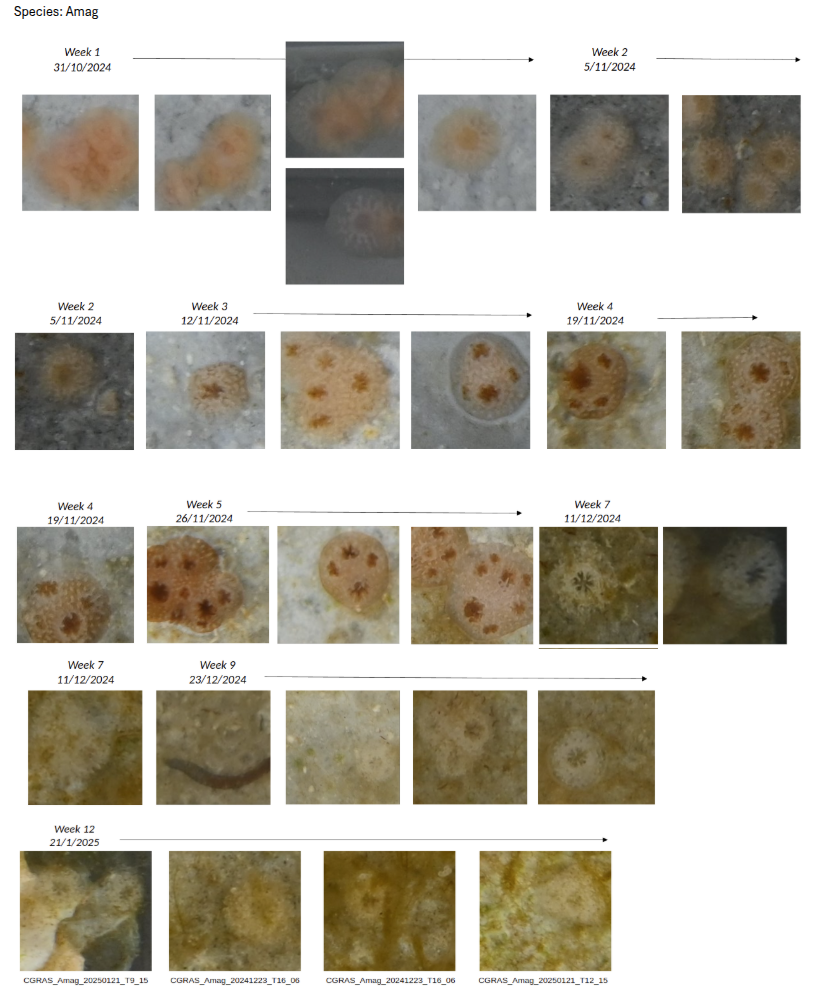
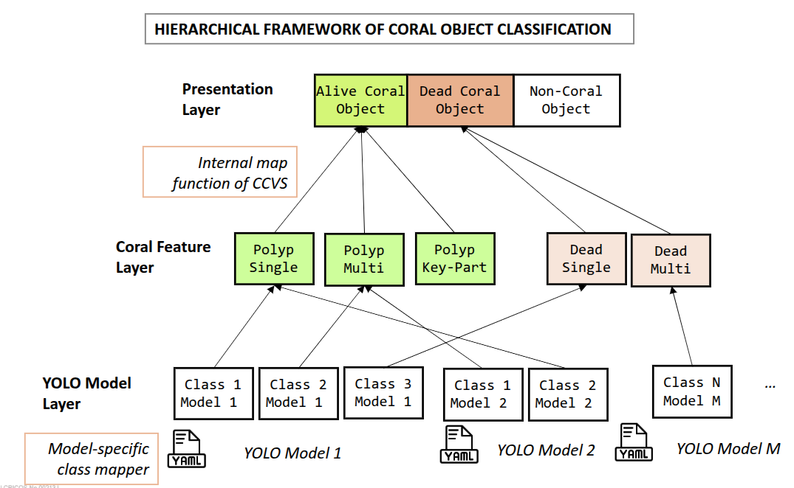
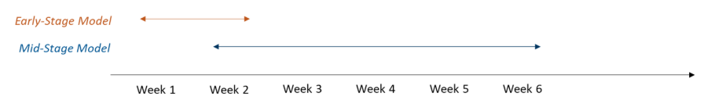
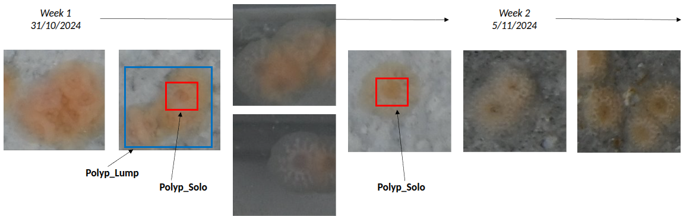
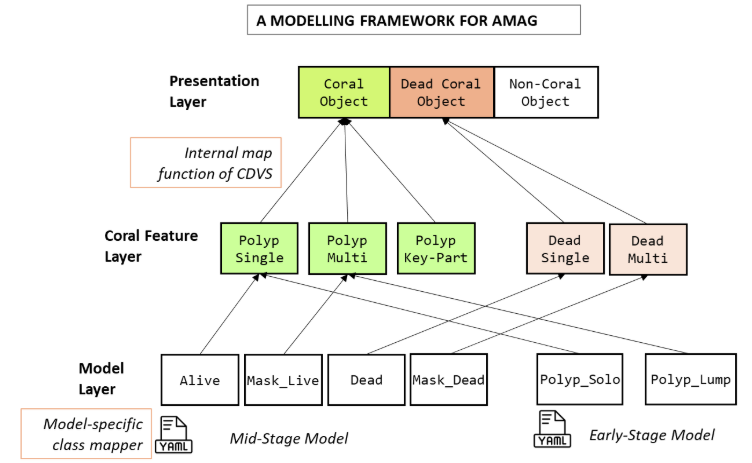

# CGRAS 2025: Modelling Coral Object Detection in CCVS

This document explains the semantics of coral counting and coral object classes in CCVS.

---
## Counting Coral Objects

CCVS is designed to count three types of objects: alive corals, dead corals, and other objects. The _other objects_ refer to those that are not corals, alive or dead, but of interest to the users.  CCVS uses a combination of bespoke object detection models and heuristics to infer these classes of objects based on their visual appearance. 

The visual appearance of corals of different species can change drastically. There are over 600 species in the Great Barrier Reef alone. Even for corals of the same species, the shape, color, and structure of corals can change significantly within weeks. The following figure illustrates the different appearance of the Amag species between week 1 to week 6 since settlement on the tile.



Counting alive coral objects depends on accurate identification of individual corals through distinctive visual features. As seen above, an individual coral is sometimes better identified as a whole and other times identified through its parts. More specifically, the corals in the first week lack an internal structure and they are better identified as a pinkish blob. The more matured corals, on the other hand, contain multiple visually distinctive polyps as their internal structure. Modelling an individual coral as the whole and modelling through its parts are both suitable approaches for counting alive corals.

CCVS has adopted a hierarchical framework of coral classes in order to support the two modelling approaches.

---
## Hierarchical Framework of Coral Classes

The hierarchical framework of the CCVS is described in the following figure.



The framework stipulates that every object is progressively assigned with three annotations from low to high semantic levels. The process starts from the bottom, the __YOLO model layer__, which represents the initial detection of candidate objects based on visual appearance. The possible classes of a __model label__ are dependent on how the applicable YOLOv8 model and are therefore custom and modeller-defined. 

The next layer up is the __coral feature layer__ which defines several cononical classes for interpreting the custom classes of the __model layer__. This layer allows the custom classes to be mapped into coral feature classes that are understood by the CCVS. The following table summarizes the four coral feature classes.

| Coral Feature Classes | Visual Features | Significance |
| ------- | ------- | ------- |
| POLYP_SINGLE | A coral with a single polyp | Contributes to one count of `alive_coral` |
| POLYP_MULTI | A coral with multiple polyps | Contributes to one count of `alive_coral`|
| POLYP_KEYPART | A key part of a coral | Indirectly or partially contributes to one count of `alive_coral` |
| DEAD_CORAL | A part or a whole dead coral | Indirectly or partially contributes to one count of `dead_coral`|
| OTHER | A part or a whole other object | Contribute to one count of `other`|

> [!NOTE]
> The `OTHER` coral feature class is currently not fully implemented in CCVS.

The top layer is the __presentation layer__ which contributes to counting of alive corals, dead corals, and other objects. The following table summarizes the three presentation classes.

| Presentation Classes | Description | Significance to Counting |
| ------- | ------- | ------- |
| `alive_coral`  | An alive coral biologically | Contributes to one count of `alive_coral` |
| `dead_coral` | A biological coral that is now dead | Contributes to one count of `dead_coral`|
| `other` | A non-coral object of interest  | Contributes to one count of `other` |
| MASKED  | The object has no presentation label | Does not contribute to any counter |

### Map Function between YOLO Model Labels and Coral Feature Labels

A map function between the bottom layer and the middle layer is found in the Coral Object Detection (COD) models and it is specified by the coral modeller who develops the COD models. The actual function is included in the COD model yaml file. Each cononical class of the coral feature layer is mapped to zero or more classes of the YOLO model layer. 

The following is an example of such a map function.  It specifies the semantics of the classes from a YOLO model, `mask_live`, `alive`, `dead`, `mask_dead`, using the coral features labels.
 
```yaml
classes_map: 
  POLYP_SINGLE: []
  POLYP_MULTI: ['mask_live']
  POLYP_KEYPART: ['alive']
  DEAD_CORAL: ['dead', 'mask_dead']
```

### Map Function between Coral Feature Labels and Presentation Labels

The CCVS has implemented a heuristic-based map function to derive the presentation layer label from the coral feature labels of every object, and effectively counting the coral objects.

A major complication in the counting task is the probable children objects enclosed within a parent object.  For example, an object of `POLYP_MULTI` is normally counted as an alive coral. If it has enclosed other objects, then the enclosed objects should not be counted as coral even if they are `POLYP_MULTI` or `POLYP_SINGLE`. More complication, however, may be result from having `DEAD_CORAL` objects enclosed within the `POLYP_MULTI` object. 

The first step in the heuristic-based map function aims to resolve the parent-children object sets.  It determines the presentation label of the parents and whether to mask the children (i.e. assign the special `MASKED` label).

```yaml
If the parent object's coral feature label is `POLYP_MULTI`, then
  If the number of `POLYP_KEYPART` and `POLYP_SINGLE` children is more than that of `DEAD_CORAL` and 'OTHER', then
    Assign `ALIVE_CORAL` as the presentatation label of the parent object
  Else if the number of `DEAD_CORAL` children is more than that of `POLYP_KEYPART`, `POLYP_SINGLE` and 'OTHER', then
    Assign `DEAD_CORAL` as the presentatation label of the parent object
  Else
    Assign `OTHER` as the presentatation label of the parent object
  

Elif the parent object's coral feature label is `POLYP_KEYPART`, then
  Assign either `ALIVE_CORAL` as the presentatation label of the parent or skip (depending on the configuration parameter mask_polyp_keypart)

Elif the parent object's coral feature label is `POLYP_SINGLE`, then
  Assign `ALIVE_CORAL` as the presentatation label of the parent object

Elif the parent object's coral feature label is `DEAD_CORAL`, then
  Assign `DEAD_CORAL` as the presentatation label of the parent object

Elif the parent object's coral feature label is `OTHER`, then
  Assign `OTHER` as the presentatation label of the parent object  

Assign `MASKED` as the presentatation label of all the children objects
```

The second step involves assigning the presentation label of all objects that are not yet assigned.
```yaml
If the object's coral feature label is `POLYP_MULTI` or `POLYP_SINGLE`, then
  Assign `ALIVE_CORAL` as the presentatation label of the object
Elif the object's coral feature label is `POLYP_KEYPART`, then
  Assign either `ALIVE_CORAL` or `MASKED` as the presentatation label of the parent (depending on the configuration parameter mask_polyp_keypart)
Elif the parent object's coral feature label is `DEAD_CORAL`, then
  Assign `DEAD_CORAL` as the presentatation label of the object
Elif the parent object's coral feature label is `OTHER`, then
  Assign `OTHER` as the presentatation label of the object
Elif the parent object's coral feature label is `UNDEFINED`, then
  Assign `MASKED` as the presentatation label of the object
```

----

## Example A Dual YOLO Model Setup

The CCVS allows the use of more than one YOLO models to analyze a tile sample and detect coral objects. The system contains heuristics to resolve the duplication of objects that are expected to emerge from multiple models.  

A use case of such dual or multiple model setup is to develop models specialized in detecting corals at different development stages. The early stage and the middle stage of post-settlement corals can look significantly different. Refer to the figure at the top of this page for the example of the species _Amag_.

Usually for the accuracy of object detection models, a more specific model perform better than a general model. A strategy for detecting corals of the species _Amag_ is to train two models, one for the early stage and another for the middle stage. The applicable scope of the early stage model is between week 1 and week 2, and that of the middle stage model is week 2 to week 6.  The moment of coral settlement is a spread of days, and so on the aquaculture tiles in week 2, corals of both development stage co-exists.  



The early stage model defines two classes:
1. Polyp_Solo (Polyp-Single): a single polyp in its entirety lying flat. 
2. Polyp_Lump (Polyp-Multi): multiple pancake-like and single polyps of various orientations in a lump. 



The middle stage model defines four classes:

1. Alive (Polyp-Core): the centre part of a polyp including the mouth and the surrounding tentacles. 
2. Mask_Live (Polyp-Colony): a structure comprising more than one polyp with a well-formed boundary.  
3. Dead (Dead Single): a dead single polyp. 
4. Mask_Dead (Dead Multi): a dead polyp colony. 

The following figure shows how the above classes of model labels are mapped to the coral feature label classes.



Note that the `POLYP_SINGLE` and `POLYP_MULTI` coral feature classes are used by both the early stage model and the middle stage model through their own model classes and the map function. Duplication removal kicks in after the objects have acquired one of these coral feature labels.

----

## Conclusion

The accuracy of a one-size-fits-all YOLO object detection model is hampered by the changing visual appearance between different coral species and between different development stage.  CCVS supports import of new coral object detection models through the web interface. The import function enables CCVS to handle tile samples of more varieties of coral species and to use more specialized models to increase detection accuracy. Additionally, the support of using two or more models on the same tile samples allows CCVS to better handle transitional periods between development stages of corals.

The extensibility of coral detection capability is largely enabled by the hierarchical framework of coral classes. The framework explains the semantics of coral counting and defines an intuitive connection between object detection and coral counting.  It supports at least two approaches of how object detection can contribute to coral counting.  The framework is so far proven sufficient for the modelling of around three coral species. 

Further research on more expressive connection between object detection and coral counting is expected. No attempt of developing object development model has yet to be made to many coral species.  It is likely that the hierarchical framework may need further extension or even an overhaul for a difficult coral species. 

---
## Links

- [Introduction to the CCVS and Installation Guide](../README.md)
- [User Manual](./USER_MANUAL.md)
- [Design Diagrams](./DESIGN.md)
- [Summary of Processing Errors and System Issues](./ERROR_CODE.md)

---
### Developer of the System

Dr Andrew Lui, Senior Research Engineer <br />
Robotics and Autonomous Systems, Research Engineering Facility <br />
Research Infrastructure <br />
Queensland University of Technology <br />

### Author

Dr Andrew Lui <br />
Latest update: June 2025