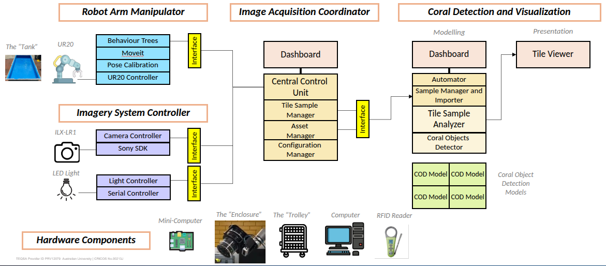
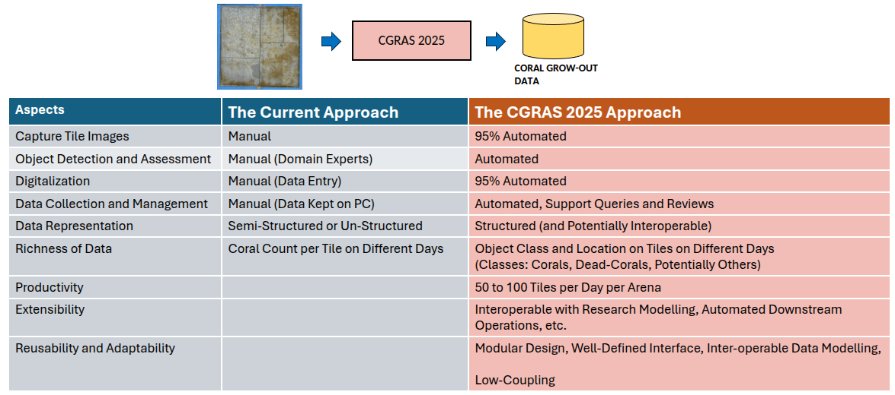
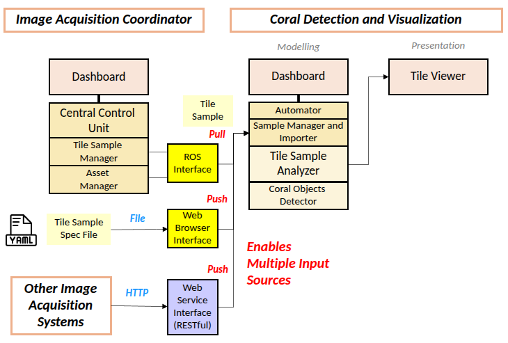
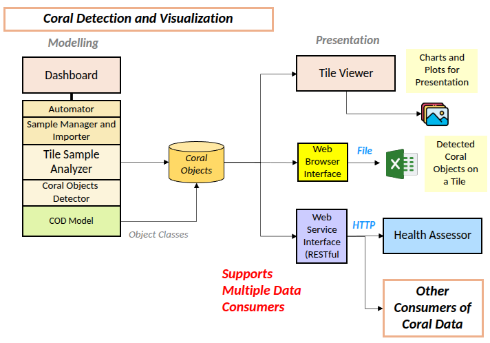
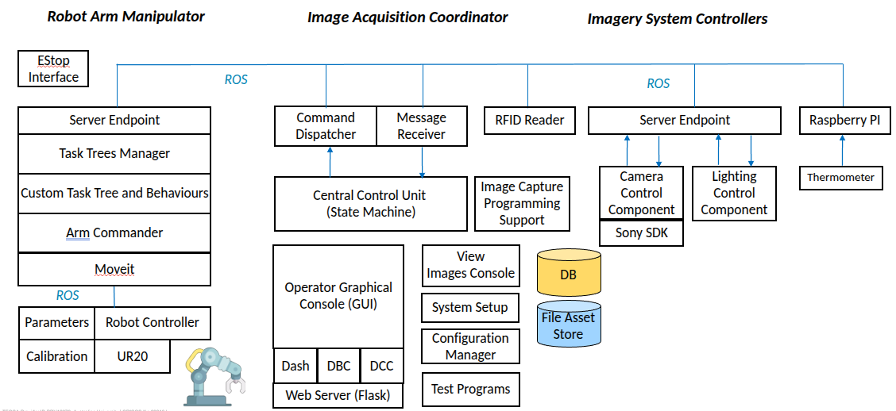
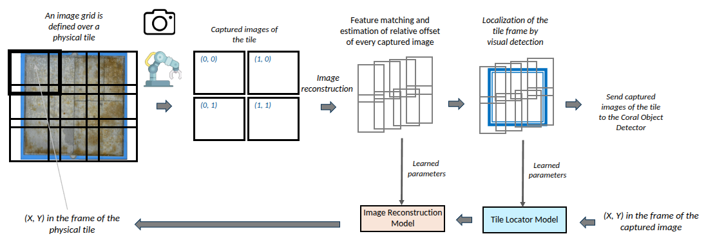
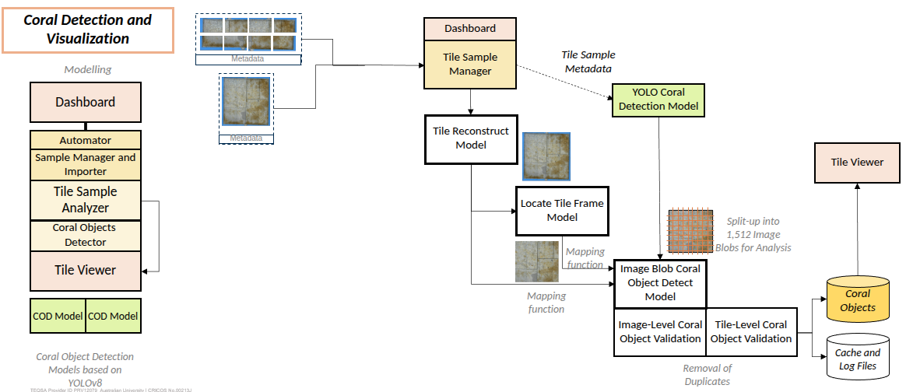
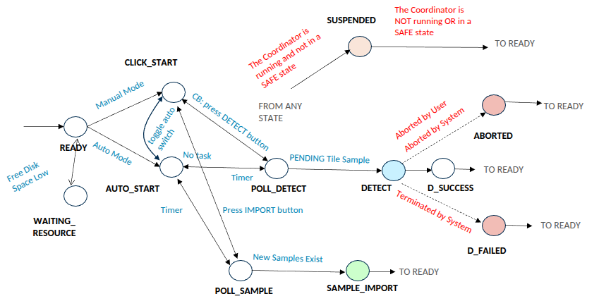
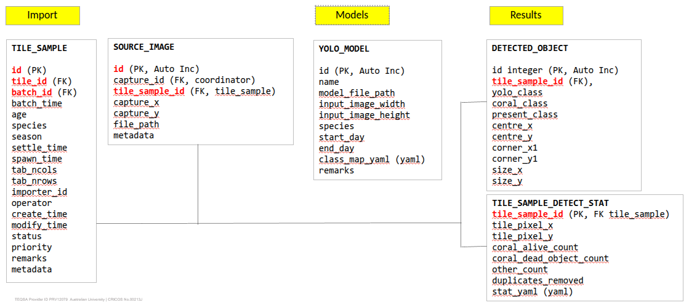

# CGRAS 2025: Design Diagrams of CCVS

This page displays key design diagrams of the Coral Counting and Visualization System (CCVS).

## CGRAS 2025

Monitoring the number of corals in the early post-settlement period of microscopic coral recruit phase is desirable in coral aquaculture operations and research. The data is imperative for the evaluation of instrument design and operational parameters, and for extending the knowledge of coral growing in controlled environments.

The following diagram explains the aim of the CGRAS 2025 project.



The task is now often carried out by coral experts, who have the knowledge to identify coral recruits from images of coral aquaculture tiles captured by a camera. The major objective of CGRAS is to automate the task, enrich the data, and enhance the coral aquaculture operations and research as a whole with potential streamlining upstream and downstream tasks.

The following table compares the current manual practice and the CGRAS 2025 approach.



## CCVS in CGRAS 2025

The CCVS in CGRAS 2025 work with the Image Acquisition Coordination System (IACS) so that a significant portion of the coral growout monitoring can be automated.  The IACS is considered as the upstream application in the automated monitoring process.



The CCVS is designed to be capable of operating on its own, or integrating with an upstream application other than IACS and one or more downstream applications. 



In the upstream direction, CCVS retrieves or being pushed imagery samples of aquaculture tiles.  It supports three types of interface:
- Pull tile samples from the IACS (or another upstream applications) through the ROS Noetic middleware (ROS service call).
- Being pushed tile samples through the web interface (specified as a Yaml file).
- Being pushed tile samples through the RESTful API (experimental feature only).

In the downstream direction, CCVS supports the following methods of retrieving coral counting data.
- Download data as an excel file.
- Download graphical representation of the data as image files.
- Transfer data through the RESTful API (experimental feature only).

THe following figure shows the architecture of the whole CGRAS 2025 system and the structure of the CCVS and IACS.




## The Detect, Count and Locate Task of the CCVS

A major task of the CCVS is to detect, count, and locate coral objects. Coral objects are small and therefore the resolution of the image samples requires to be very high. To achieve the required resolution suitable for object detection, imagery capture of an aquaculture tile is split into a grid of images, each of which covers an area of the tile. CCVS is designed to handle a regular grid of images as the input tile sample.



CCVS uses a YOLOv8 model to detect coral objects and to use a heuristic-based algorithm to convert the detection into count data. One of the intended downstream application is to determine the relative yield of corals on different parts of a tile. The spatial distribution of coral objects is therefore of great interest. To localize the detected objects with respect to their home aquaculture tile, the grid of images must be merged together so that the original tile can be visually reconstructed. 

The detect, count, and locate task of the CCVS comprises the following stages:
- Visual reconstruction of the original tile from grid of sample images.
- Identification of the tile from the securing structure (such as the holder of the tile) and the re-align the tile if mis-alignment occurs during image capture.
- Detection of coral objects.
- Removal of duplications of objects resulting from methods used in the previous stages.
- Generation of statistics and transfering the data to a persistent storage.




## Task Automation in the CCVS

The task automation in the CCVS is driven by a state transition machine.



## Data Modelling in the CCVS

The following diagram describes the important database tables for data modelling in the CCVS



#### Table for Import Data: Tile Sample

The CCVS system (the detector) relies on an external source of imagery data for processing. ​
- Pull the imagery data from the IACS via ROS service calls.​
- Import through the GUI​
- Import through RESTful API (experimental only)​

Regardless of the source, the imported tile samples and the associated source images are modelled by the table tile_sample and source_image.

The table `tile_sample models` a sample of images captured of a particular tile (tile_id) in a particular batch (batch_id). It captures the information of a tile sample that is essential for processing.  ​

- The CCVS (the detector) is designed to operate without the IACS (the coordinator). The information that can be found in the TileDB of the IACS, such as age, species, tab_ncols are therefore copied to the table.​
- The duplicated attributes include batch_time, age, species, season, settle_time, spawn_time, tab_ncols, tab_rows, metadata, remarks​

The attributes `importer_id` and `operator` keep track of how the tile sample was imported.​

The attributes `create_time` and `modify_time` refer to the creation and modification of this record.

The system tracks the processing of tile samples using the attributes status and priority.  The status denotes the processing status of the tile sample.​
```python
ALL = -1     # only for query, not stored in DB​
QUEUED = 0​
DONE = 1​
FLAGGED = 2  # ABORTED may be due to interrupted by user or by a recoverable error (not from the data itself) such as no suitable YOLO model​
REJECTED = 4  #REJECTED may be due to rejected by user or rejected by the system if a non-recoverable error is found in the input data​
```
The `priority` is a value denotes the position of the tile sample in the queue pending processing.

#### Table for Import Data: Source Image

The table `source_image` models an image of a tile sample.  The attributes capture_id, capture_x, capture_y (the logical capture location of the tile), and metadata are copied from the source.​

The `file_path` is a path in the local file system.  It assumes that the image file is already in the local file system or moved to the local file system by the importer.

#### Table for Modelling: Yolo Model

The table `yolo_model` models a detector capable of returning a list of coral objects of an image. The detector is based on a YOLOv8 model trained specifically for a particular species and a particular period of growout (between start_day and end_day).​

The attribute class_map_yaml defines mapping between the arbitrary class names adopted by the YOLO model and the system-defined coral classes:​
- POLYP_SINGLE​
- POLYP_MULTI​
- POLYP_KEYPART​
- DEAD_CORAL

#### Table for Result Storage: Detected Object

The table `detected_object` models an object detected in a tile sample by the detector. The geometric attributes of the object are defined by the attributes centre_x, centre_y, corner_x1, corner_y1, size_x, and size_y.  The values are normalized to the range (0, 1) along the x and y axes of the image. ​

The attributes `yolo_class`, `coral_class`, and `present_class` describe the object classification at different hierarchical levels.  Refer to the document about the hierarchical classification framework for the details.​
- `yolo_class`: the output of the YOLO model​
- `coral_class`: describes the essentials of a coral​
- `present_class`: describes the classification for counting

#### Table for Result Storage: Detect Statistics

The table `tile_sample_detect_stat` models the detection statistics of a tile sample and the dimension of the tile for conversion between the normalized space and the pixel space.​

- `tile_pixel_x`, `tile_pixel_y`: the dimension of a tile in pixels.​
- `coral_alive_count`, `coral_dead_object_count`, `other_count`: the number of alive corals, dead corals and other objects.​
- `duplicated_removed`: the number of objects removed in the duplication removal process.​
- `stat_yaml`: more details regarding the detection results of the tile sample

## Links

- [Introduction to the CCVS and Installation Guide](../README.md)
- [User Manual](./USER_MANUAL.md)
- [Modelling Coral Object Detection](./CORAL_CLASSES.md)
- [Summary of Processing Errors and System Issues](./ERROR_CODE.md)

## Developer of the System

Dr Andrew Lui, Senior Research Engineer <br />
Robotics and Autonomous Systems, Research Engineering Facility <br />
Research Infrastructure <br />
Queensland University of Technology <br />

## Author

This document is written by Dr Andrew Lui <br />
Latest update: June 2025