# CGRAS 2025: A Concise Manual for Users of the Web Interface of CCVS 

The Coral Counting and Visualization System (CCVS) is designed for learning the amount and spatial-temporal distributions of post-settlement corals growing on aquaculture tiles. It automates the tasks of importing image samples of aquaculture tiles, visually reconstructing the whole tiles, detecting and counting corals in the images of tile samples, and generating charts for effective data visualization.

## Introduction to the Web Interface

CCVS users can access the following functions through the web interface.
- Dashboard for task monitoring 
- Manager for manipulating the processing queue of and individual tile samples
- Interactive viewing panel for the amount of spatial-temporal distributions of corals of aquaculture tiles of a spawning season.
- Manager for coral detection models

The default port of the web interface is 8023.  Refer to the parameter `web_port` in the system configuration file for the actual port. The above functions can be accessed through the top menu bar of the web interface, which is illustrated in the figure below.


The clickable menu bar has four items that correspond to the four functions.
- __Monitor__: Application and task monitor
- __Sample__: Tile sammple manager
- __View__: Interactive coral count viewing panel
- __Model__: Coral detection model manager

----

## The Application and Task Monitor 

The Application and Task Monitor is the landing page of the web interface. It servers the following purposes:
- Enables users to know the current execution status, change between automated and manual task/job execution modes, and to interactively execute a job.
- Inform users the execution progress of the current task/job.
- Provides users with statistics of task/job execution.
- Provides users with the execution outcomes of recent tasks/jobs.
- Inform users the status of system resources such as GPU, CPU, and free disk space.
- Notify users errors occurred in task/job execution and critical system status.


The above figure shows the major panels of the monitor. Every panel serves one of the six above-listed purposes.

### The Task/Job Control Panel

CCVS has implemented two tasks/jobs that are critical for its designed purposes:
- Query and retrieve new tile samples from a producer. In CGRAS 2025, the __Image Acquisition Coordinator__ is a producer of tile samples. CCVS can integrate with any producer of tile samples that have implemented the appropriate ROS services.
- Detect, count, and locate coral and other relevant objects. 

In the __automated execution mode__, the two tasks/jobs are fully automated. The CCVS will continually polls the tile sample produces for new samples and the tile sample processing queue for samples pending the detection task.

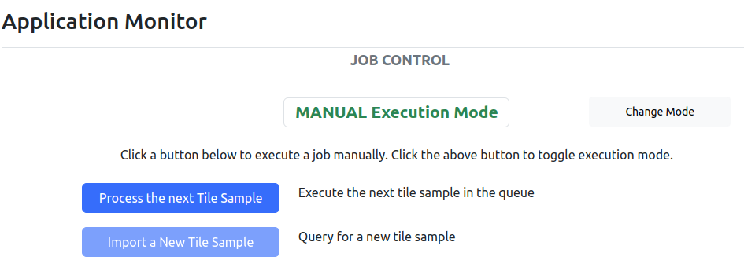

The __manual execution mode__ is useful for testing and situations which the processing queue needs to be manually managed. On the Job Control Panel (see above), a button is for processing the next tile sample in the queue and another button is for importing a new tile sample (one at a time). Note that the button for importing a new tile may be disabled if the _Import Tile Sample From Upstream_ setting is disabled. The setting can be changed using the Tile Sample Manager page (see below).

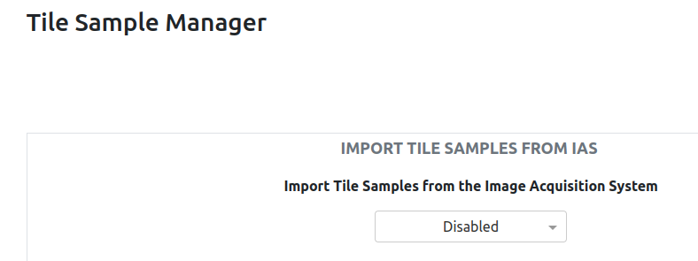

> [!NOTE]
> The execution mode at system launch can be preset through the system configuration file - parameter `task_automation`.
> ```
>  # automation mode (whether the task execution is automated)
>  task_automation: False  
> ```

### The Statistics Panel

This panel displays the job execution statistics, such as # of successful and failed jobs.

> [!NOTE]
> The statistics may be cleared through the hidden system page by an authorized system administrator.

### The System Resources Panel

This panel displays the current availability of key system resources such as # CPUs, availability of GPU, memory and disk space.

> [!TIP]
> It is useful to check the available disk space before the start of a spawning season to make sure it is enough for the coming exercise.

### The Job Execution Panel

This panel becomes active when the system is executing/processing tile samples. The progress bar indicates the progress of processing a tile sample, of which the ID is displayed to the left. Clicking the __Cancel__ button will cancel the current job.  

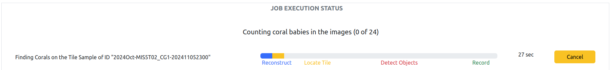

> [!TIP]
> The Cancel button may sometimes take a few moments to cancel the job, especially when the system is busy on number crunching.  

### The Status of Recent Jobs Panel

The table on this panel displays the status of the most recent 100 jobs.  Use the controls at the bottom right hand of the table to change page.  There is a status associated with every job, which may be one of the following:
- `SUCCESS`: the job has been successfully completed and the findings of the tile sample have been saved to the data storage for viewing.
- `FAIL`: an error occurred when executing the job and the error is believed to be unresolvable by users, such as missing a file or features are inadequate for image reconstruction. More information may be provided in the Processing and System Issue panel to the right.
- `RECOVERABLE_FAIL`: an error occurred when executing the job, but the error may be resolved. For example, growing on a tile sample is a species that there is no matching Coral Detection Model in the system. The tile sample may be re-processed after the import of a suitable Coral Detection Model.  Again, more information may be provided in the Processing and System Issue panel.

> [!NOTE]
> To re-process a tile sample after a failed job, go to the Tile Sample Manager, select the tile sample from the __processed samples__ panel and use the __Redo__ button.

### The Procssing and System Issues Panel

The table on this panel displays abnormal issues resulting from job execution or system resources status. The issues are colour coded as follows. A brighter red issue indicates something important such as running out of disk space.  A dull red issue indicates exceptions related to the processing of a tile sample.

To dismiss a particular issue, click on the circular button in the first column of the row associated with the issue.

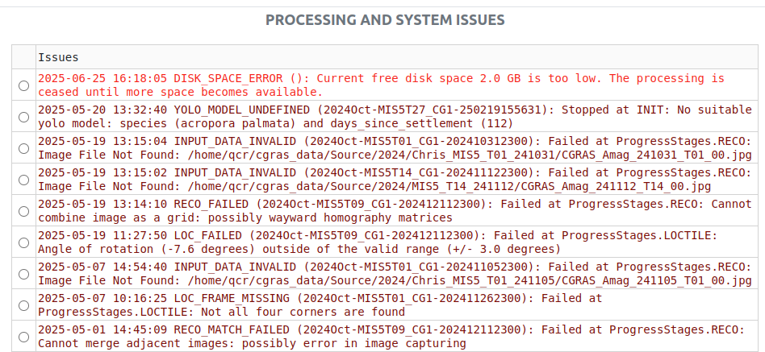

----

## The Tile Sample Manager

The tile sample manager serves the following purposes:
- Enables/disables the import of tile samples from the upstream application.
- Provides an interface for manual import of tile samples.
- Dipslays and provides an interface to manage the queue of tile samples pending processing.
- Displays and provides an interface to manage the processed tile samples.

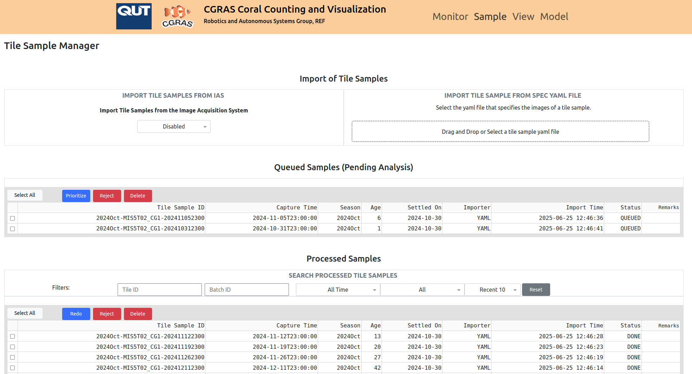

### The Import Tile Setting Panel

The purpose of this panel is described above.

### The Import Tile Sample From Spec Yaml File Panel

This panel provides an interface for the manual import of a tile sample, of which the details such as tile identification, species, dates and the location of image files are specified in a YAML file.  A YAML file is a text file which is not unlike a form.  This panel is useful when images of tiles are taken manually. The details of the manual sampling can be entered into a YAML tile and then submitted to the system through this panel. 

Some samples of the YAML file can be found in the source repository under `/docs/tile_samples`.  The following shows an example.

```yaml
tile_id: 2024Oct-MIS5T14
species: Acropora
settle_time: 2024-10-30
spawning_time: 2024-10-15
season: 2024Oct
num_tabs: [20, 20]
tile_size: [280, 280]
frame_size: [294, 294]
batch_id: CG1-202410312300
batch_time: 2024-10-31 23:00:00
importer_id: YAML
operator: luia2
image_files_parent_folder: /home/qcr/cgras_data/Source/2024/MIS5_T14_241031
images:
  - x: 0
    y: 0
    file: CGRAS_Amag_241031_T14_00.jpg
  ...
```
The entries of the _form_ are described below.

| Parameter     | Remarks         |  |
| :----------------    | :------: | :------: | 
| `tile_id` | The ID of the tile, which is made up of the season and the PIT tag ID (connected by a hyphen) | Mandatory |
| `species` | The species of the coral that is growing on the tile | Mandatory |
| `settle_time` | The date that the coral larvae was allowed to settle on the tile | Mandatory |
| `spawning_time` | The date that the coral spores spawned | Mandatory |
| `season` | The spawning season | Mandatory |
| `num_tabs` | The number of tabs of the tile| Mandatory |
| `tile_size` | The width and the height of this tile (in mm)  | Option |
| `frame_size` | The width and the height of the frame of this tile (in mm)  | Option |
| `batch_id` | The batch ID, which comprises of the CGRAS station ID and the sampling time (connected by a hyphen) | Mandatory |
| `batch_time` | The date and time of the sample  | Mandatory |
| `importer_id` | Denotes how the tile sample is imported | Optional |
| `operator` | Denotes the operator of the import action | Optional |
| `image_files_parent_folder` | The path if all the images are in the same folder | Optional |
| `images` | A list of records each of which describes the location of the image file and the index in the capture grid | Mandatory |

Each record under the `images` node has the following fields.

| Image Parameters     | Remarks         |  
| :----------------    | :------: | 
| `x` | The column index of the image in the capture grid  |
| `y` | The row index of the image in the capture grid  |
| `file` | The path to the image if the string starts with `/` or image filename if otherwise  |

> [!NOTE]
> The images referred in the YAML files must be found on the hard disk mounted to the host computer (either locally mounted or network mounted).

### The Queued Samples Panel

The table in this panel displays the queue of tile samples pending processing by the system's coral object detection process.  The table is interactive and supports the selection of one or more tile samples for the following actions:
- __Priortize__: The selected tile samples are moved to the front of the queue.
- __Reject__: The state of the selected tile samples is changed to `REJECTED`, meaning that the tile samples are considered useless and any associated findings are deleted.  However, a `REJECTED` tile sample may be moved back to the processing queue using the Processed Samples Panel.
- __Delete__: The selected tile samples, together with any data, are deleted from the system permanantly. 

Click on the square button in the first column to select/unselect a tile sample.

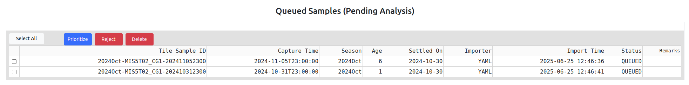

### The Processed Samples Panel

The table in this panel displays the tile samples that have been processed, flagged, rejected.  The table is interactive and supports the selection of one or more tile samples for the following actions:

- __Redo__: The selected tile samples are moved to the processing queue for re-processing. More details are given in the sub-section below.
- __Reject__: The state of the selected tile samples is changed to `REJECTED`, meaning that the tile samples are considered useless and any associated findings are deleted.  However, a `REJECTED` tile sample may be moved back to the processing queue using the Processed Samples Panel.
- __Delete__: The selected tile samples, together with any data, are deleted from the system permanantly. 

Click on the square button in the first column to select/unselect a tile sample. 

Click on other columns of the row of a tile sample will bring up a popup menu through which some data resulting from the processing may be viewed (subject to system configuration).  More details are given in the sub-section below.

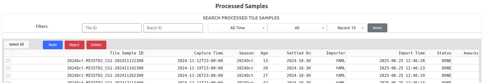

This panel provides a search/query sub-panel for displaying the tile samples based on specific _tile ID_, _batch ID_, and retain the tile samples based on the time and status and the maximum number of results.

Click on the __Reset__ button to restore the default display.


#### The Redo Action

The re-do action moves one or more tile samples back to the processing queue. In the action, the users may select to retain some or none of the findings resulting from the previous processing.  The following popup will appear when clicking the __Redo__ button for a selected set of tile samples.

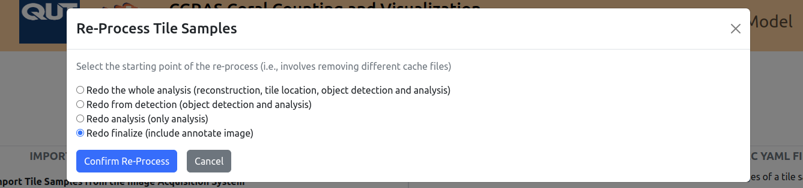

There are four options to choose related to the retaining of existing findings.
1. Redo the whole analysis (reconstruction, tile location, object detection and analysis): retain nothing.
2. Redo from detection (object detection and analysis): retain the data associated with the reconstruction of tiles and the localization/correction of tile frames. 
3. Redo analysis (only analysis): in addition to that of the above option, retain the outcomes of the coral detection models.
4. Redo finalize (include annotate image): in addition to that of the above option, retain the outcomes of coral class mapping.

For example, if the tile samples are to be re-processed due to an updated coral detection model, option 2 is appropriate. If a new coral class mapping is defined and imported, select option 3 to save the time in running the coral detection model on the tile sample again.

#### The View Analysis Results Popup

The popup provides up to four buttons for users to examine the details of tile sample processing.
- Reconstructed Tile: display the visual appearance of the tile after image reconstruction.
- Annotated Tile: display the detected coral objects and their locations on the constructed tile.
- Feature Matching Images: display the results of feature matching which is a critical step in tile image reconstruction.
- Annotated Blobs: display the output of the coral detection models on the individual image blobs, which are sub-image cropped from the original images in the tile sample

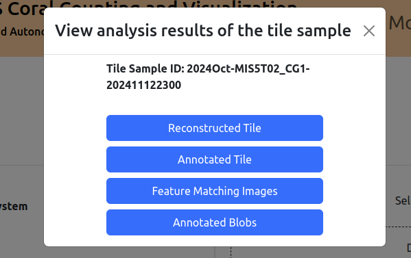

Note that some buttons may be disabled due to system configuration settings or processing failures.

----

## The Interactive Coral Detection Findings Browser

The interactive coral detection findings browser provides an interactive interface for users to examine the count of coral objects and the spatial distribution/temporal trend of the objects of tile samples. It serves the following purposes:
- Enables the users to select a tile from a filtered list of tiles for finding reviews.
- Allows the users to examine the basic data, sampling and processing status of the selected tile.
- Generates charts and graphics for the users to review the spatial distribution/temporal trend of the objects of selected tile.
- Provides the users with interactive controls of the charts and graphics to assist more effective data visualization.
- Provides methods for the users to download charts and data as computer files for offline processing.

### The Tile Table 

The tile table lists the tiles of which samples of them are found in the system.  The table divides the set of tiles into pages ordered by the _Tile ID_. The table also provides a filter to retain only the interested tiles based on their _Tile ID_, _Species_, or _Settlement Date_.

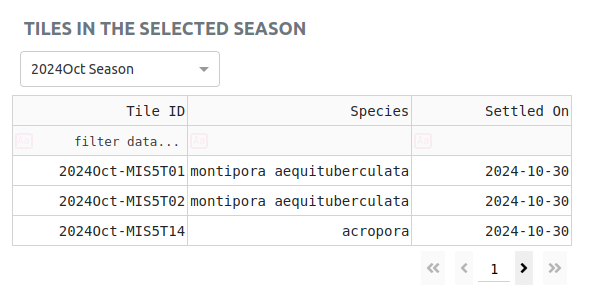

### Tile Basic Information and Temporal Trend

Clicking on one of the tile in the table will select the tile for review. The basic information of the tile is then displayed to the right. If the tile has associated findings from one or more samples, then a chart showing the temporal trend of alive coral count appears as well.  The _alive coral count_ is as defined in the applied coral object detection model.

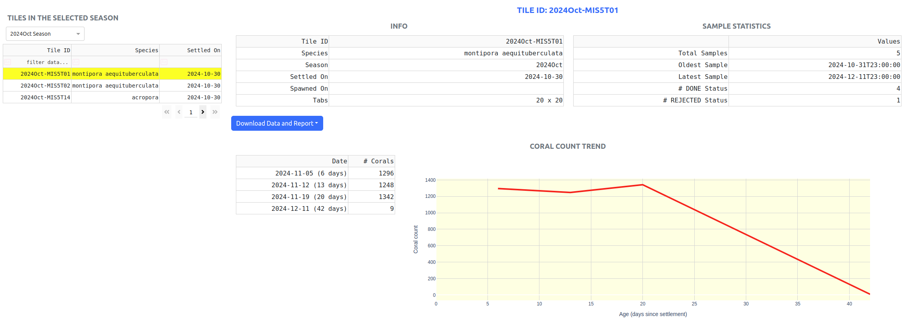

### The Download Data and Report Button

The __Download Data and Report__ button offers the users several options.

- Count Data (Excel): The excel file contains worksheets of trend of alive object count, heatmap views of object count of coral and other object types, detailed information of detected objects of every sample, and others. 
- Figure Images (ZIP): The charts and graphics saved as image files.
- Coral Count Report (Print): The web page in printable format.

### The Scatter Plot of Coral Objects Panel

This panel displays a scatter plot of coral objects of a tile sample to illustrate the spatial distribution.  Each dot represents an object.  By default, the latest tile sample is displayed.  To compare the latest tile sample with one of the earlier samples, click on one of the dates in the list to the left of the scatter plot chart. 

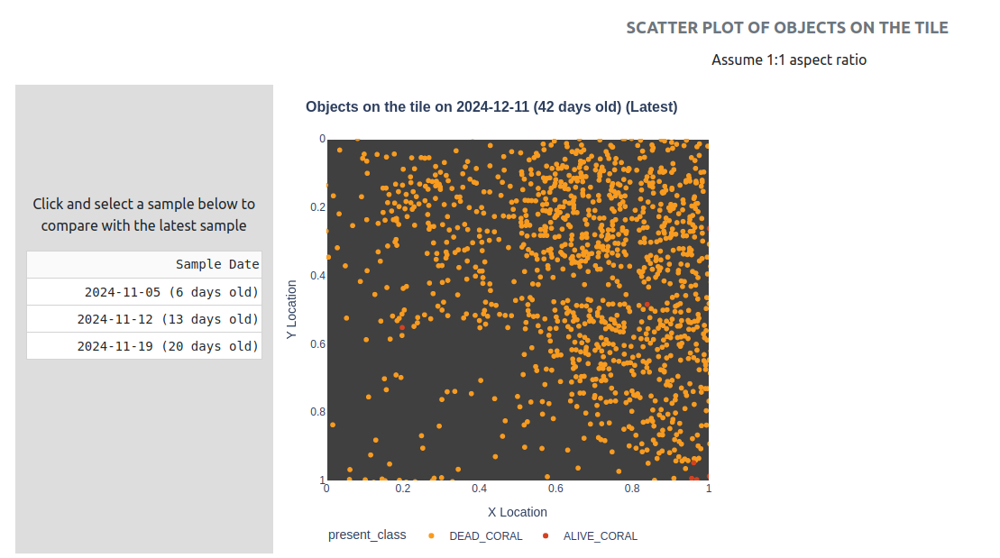

> [!TIP]
> The aspect ratio of the scatter plots is always 1:1, regardless of that of the tile from which the sample is associated with.  

### The Heatmap Panel

This panel displays a heatmap representation of coral count. Each cell in the heatmap corresponds to a tab of the physical tile. By default, the latest tile sample is displayed. To compare the latest tile sample with one of the earlier samples, click on one of the dates in the list to the left of the scatter plot chart. To display the heatmps of all samples of the tile, click on __Whole History__.

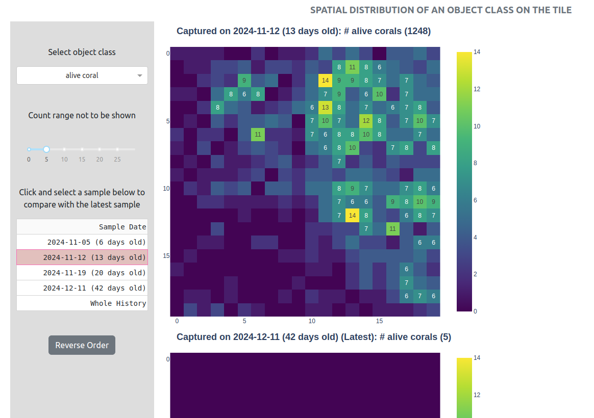

By the default, the heatmaps display the number of alive corals.  Use the dropdown menu on the left sub-panel to change to other coral object classes. 

The colour of the cell indicates the number of objects of the cell, according to the colour scale in the legend of the heatmaps.  The cells may be labeled with the actual count.  To improve clarify, labels are not displayed for low count cells. Use the slider on the left sub-panel to control the range of count that is not displayed as labels.

The heatmaps are displayed in reverse chronological order. The __Reverse Order__ button allows the order to be toggled.

----

## The Models Manager

The models manager enables the users to import, edit, and delete models critical to the operation of the CCVS. In the current version of the system, the types of models include only Coral Object Detection models.

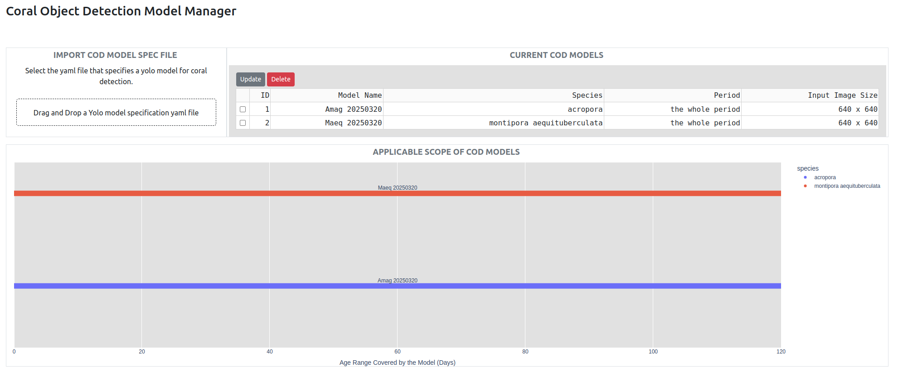

### The Import COD Model Panel

This panel provides an interface for the manual import of a coral object detection (COD) model. A COD model comprises of the following:
- A YOLOv8 model as a parameter file (`.pt`)
- Data about the YOLOv8 model and critical information about how the system should use the model, especially the names and the semantics of the object classes.

Some samples of the YAML file can be found in the source repository under `/docs/yolo_model_samples`.  The following shows an example.

```yaml
name: Maeq 20250320
file: /home/qcr/cgras_data/YoloModel/cgras_20250320_yolov8nseg_640p_first30.pt
species: montipora aequituberculata 
input_image_width: 640
input_image_height: 640
valid_start_day: 0
valid_end_day: null
classes_map: 
  POLYP_SINGLE: []
  POLYP_MULTI: ['mask_live']
  POLYP_KEYPART: ['alive']
  DEAD_CORAL: ['dead', 'mask_dead']
remarks: 
yolo_predict_params:
  conf:               # default 0.25
  iou:                # default 0.7
  agnostic_nms:       # default False
```
| Parameter     | Remarks         |  |
| :----------------    | :------: | :------: | 
| `name` | The name of the coral detection model | Mandatory |
| `file` | The full path to the trained YOLOv8 model file (.pt) | Mandatory |
| `species` | The species that this model is applicable |  Mandatory |
| `input_image_width` | The image width expected by the YOLOv8 model | Mandatory |
| `input_image_height` | The image height expected by the YOLOv8 model |  Mandatory |
| `valid_start_day` | The start of the age range that this model is applicable | Optional |
| `valid_end_day` | The end of the age range that this model is applicable  | Optional | 
| `classes_map` | The node that maps the output classes of YOLOv8 model to the internal classes | Mandatory | 
| `remarks` | Additional description | Optional | 
| `yolo_predict_params` | The node that defines yolo prediction parameters | Mandatory | 

The significance of `classes_map` is to map the classes of the YOLOv8 model, which depends on the modelling of coral objects and the choice of class names, to the internal coral classes of the CCVS, which comprises of the following.

| CCVS Coral Classes     | Remarks         |  
| :----------------    | :------: | 
| `POLYP_SINGLE` | Represents a singleton coral polyp (not in a cluster/colony)  | 
| `POLYP_MULTI` | Represents a cluster or colony of coral polyps | 
| `POLYP_KEYPART` | Represents a keypart that distinguishes a cluster or colony |
| `DEAD_CORAL` | Represents a dead coral whether it is a part or as a whole |

The `yolo_predict_params` contains parameters that are passed to the YOLO predict function call. (Ref: https://docs.ultralytics.com/modes/predict/#inference-arguments)

| YOLO Predict Params     | Remarks         |  
| :----------------    | :------: | 
| `conf` | Sets the minimum confidence threshold for detections | 
| `iou` | Intersection Over Union (IoU) threshold for Non-Maximum Suppression (NMS) | 
| `agnostic_nms` | Enables class-agnostic Non-Maximum Suppression (NMS), which merges overlapping boxes of different classes |

> [!NOTE]
> The YOLOv8 model file (parameter `file`) referred in the YAML files must be found on the hard disk mounted to the host computer (either locally mounted or network mounted).

### The Current COD Model Panel

This panel displays the current COD models available in the system, and the applicable species and age range of each model. 

Clicking on a row of the table selects the relevant model for further action:
- `Edit`: Edit the applicable species and age range of the model in a popup COD model editor.
- `Delete`: Delete the model after confirmation.

The table allows the selection of one model at a time.

### The COD Model Editor

The COD Model Editor allows the user to change the appliable species and age range of the model. The species may be edited in the text field and the range is changed through moving the range slider.

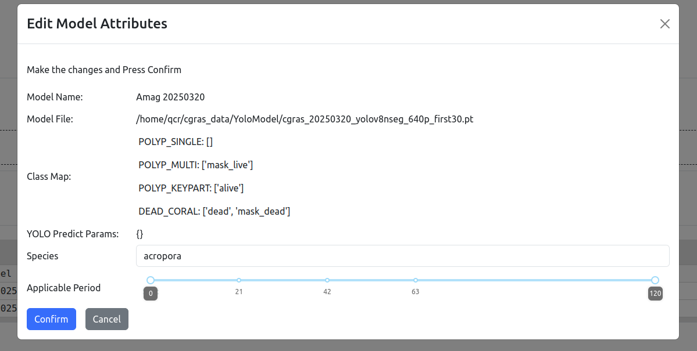

Press the __Confirm__ button to save the change or the __Cancel__ button to close the popup without any change.

### The Applicable Scope of COD Chart

The chart enables users to view the applicable scope of all the COD models currently in the system.  The chart makes it easier to find gaps in the scope. 

## Links

- [Introduction to the CCVS and Installation Guide](../README.md)
- [Modelling Coral Object Detection](./CORAL_CLASSES.md)
- [Design Diagrams](./DESIGN.md)
- [Summary of Processing Errors and System Issues](./ERROR_CODE.md)

## Developer of the System

Dr Andrew Lui, Senior Research Engineer <br />
Robotics and Autonomous Systems, Research Engineering Facility <br />
Research Infrastructure <br />
Queensland University of Technology <br />

## Author

Dr Andrew Lui <br />
Latest update: June 2025