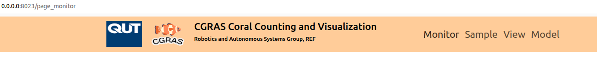

# CGRAS 2025: A Concise Manual for Users of the Web Interface of CCVS 

The Coral Counting and Visualization System (CCVS) is designed for learning the amount and spatial-temporal distributions of post-settlement corals growing on aquaculture tiles. It automates the tasks of importing image samples of aquaculture tiles, visually reconstructing the whole tiles, detecting and counting corals in the images of tile samples, and generating charts for effective data visualization.

## Introduction to the Web Interface

CCVS users can access the following functions through the web interface.
- Dashboard for task monitoring 
- Manager for manipulating the processing queue of and individual tile samples
- Interactive viewing panel for the amount of spatial-temporal distributions of corals of aquaculture tiles of a spawning season.
- Manager for coral detection models

The default port of the web interface is 8023.  Refer to the parameter `web_port` in the system configuration file for the actual port. The above functions can be accessed through the top menu bar of the web interface, which is illustrated in the figure below.

The clickable menu bar has four items that correspond to the four functions.
- __Monitor__: Application and task monitor
- __Sample__: Tile sammple manager
- __View__: Interactive coral count viewing panel
- __Model__: Coral detection model manager

## The Application and Task Monitor 

The Application and Task Monitor is the landing page of the web interface. It servers the following purposes:
- Enables users to know the current execution status, change between automated and manual task/job execution modes, and to interactively execute a job.
- Inform users the execution progress of the current task/job.
- Provides users with statistics of task/job execution.
- Provides users with the execution outcomes of recent tasks/jobs.
- Inform users the status of system resources such as GPU, CPU, and free disk space.
- Notify users errors occurred in task/job execution and critical system status.

The above figure shows the major panels of the monitor. Every panel serves one of the six above-listed purposes.

### The Task/Job Control Panel

CCVS has implemented two tasks/jobs that are critical for its designed purposes:
- Query and retrieve new tile samples from a producer. In CGRAS 2025, the __Image Acquisition Coordinator__ is a producer of tile samples. CCVS can integrate with any producer of tile samples that have implemented the appropriate ROS services.
- Detect, count, and locate coral and other relevant objects. 

In the __automated execution mode__, the two tasks/jobs are fully automated. The CCVS will continually polls the tile sample produces for new samples and the tile sample processing queue for samples pending the detection task.

